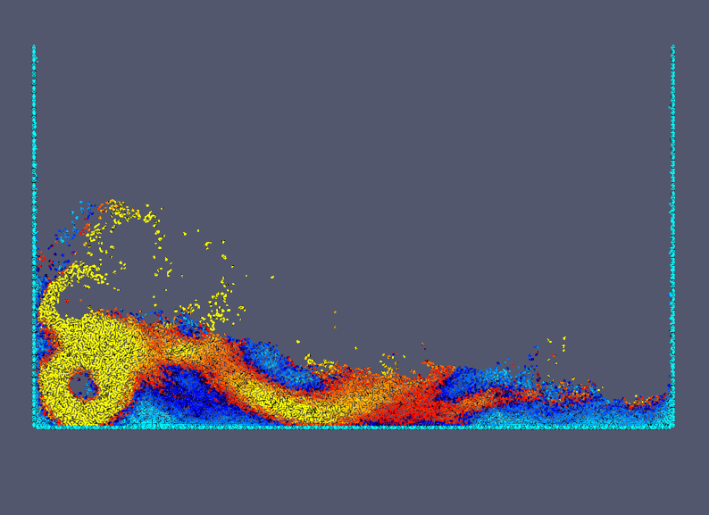

# 3: Water collapse (implicit)

```@raw html
	<br>
```

Simulation of a water column collapsing under its own weight onto dry bottom.
Here with strictly incompressible approach (Projection method).

````julia
module collapse_dry_implicit

using Printf
include("../src/SmoothedParticles.jl")
using .SmoothedParticles
using LinearAlgebra
using IterativeSolvers
using IncompleteLU
using Parameters
````

Declare constant parameters

````julia
##kernel functions
const kernel = spline23
const Dkernel = Dspline23
const rDkernel = rDspline23

const dr = 2.0e-2         #average particle distance (decrease to make finer simulation)
const h = 2.8*dr          #size of kernel support
const rho0 = 1000.0       #fluid density
const g = -9.8*VECY       #gravitational acceleration
const mu = 8.4e-4     #dynamic viscosity
const m = dr^2*rho0       #particle mass

##geometry parameters
const water_column_width = 1.0
const water_column_height = 2.0
const box_height = 3.0
const box_width = 4.0
const nlayers = 3.5 #number of wall layers
const wall_width = nlayers*dr

##temporal parameters
const dt = h/40.0
const t_end = 1.0
const dt_frame = t_end/50

##labels for particle types
const FLUID = 0.
const  WALL = 1.
const DUMMY = 2.
````

Declare variables to be stored in a Particle

````julia
@with_kw mutable struct Particle <: AbstractParticle
	x::RealVector = VEC0 #position
	v::RealVector = VEC0 #velocity
	a::RealVector = VEC0 #acceleration
	P::Float64 = 0. #pressure
	div::Float64 = 0. #divergence of velocity
	L::Float64 = 0. #free surface identier
	L0::Float64 = 0.
	type::Float64 #particle type
end
````

Define geometry and create particles

````julia
function make_system()
	grid = Grid(dr, :hexagonal)
	box = Rectangle(0., 0., box_width, box_height)
	fluid = Rectangle(0., 0., water_column_width, water_column_height)
	walls = BoundaryLayer(box, grid, 1.2*dr)
	walls = Specification(walls, x -> (x[2] < box_height))
	dummy = BoundaryLayer(box, grid, nlayers*dr) - walls
	dummy = Specification(dummy, x -> (x[2] < box_height))
	domain = Rectangle(-nlayers*dr, -nlayers*dr, 2*box_width, 3*box_height)
	sys = ParticleSystem(Particle, domain, h)
	generate_particles!(sys, grid, fluid, x -> Particle(x=x, type=FLUID))
	generate_particles!(sys, grid, walls, x -> Particle(x=x, type=WALL))
	generate_particles!(sys, grid, dummy, x -> Particle(x=x, type=DUMMY))
	create_cell_list!(sys)
	apply!(sys, find_L0!)
	Lmax = maximum(p -> p.L0, sys.particles)
	ParticleField(sys, :L0) .= Lmax
	return sys
end
````

Particle interactions

````julia
function initialize!(p::Particle)
	if p.type == FLUID
		p.x += dt*p.v
		p.v += dt*g
	end
	p.div = 0.
	p.L = 0.
end

@inbounds function viscous_force!(p::Particle, q::Particle, r::Float64)
	p.a += 2.0*m*mu*rDkernel(h,r)/rho0^2*(p.v - q.v)
end

@inbounds function find_div_and_L!(p::Particle, q::Particle, r::Float64)
	p.div += -SmoothedParticles.dot(p.x - q.x, p.v - q.v)*m*rDkernel(h,r)/rho0
	p.L += -2.0*m*rDkernel(h,r)/rho0^2
end

@inbounds function find_L0!(p::Particle, q::Particle, r::Float64)
	p.L0 += -2.0*m*rDkernel(h,r)/rho0^2
end

@inbounds function internal_force!(p::Particle, q::Particle, r::Float64)
	p.a -= m*rDkernel(h,r)*(p.P + q.P)/rho0^2*(p.x - q.x)
end

function accelerate!(p::Particle)
	if p.type == FLUID
		p.v += dt*p.a
	end
	p.a = VEC0
end
````

Functions to build the linear system

````julia
function minus_laplace(p::Particle, q::Particle, r::Float64)::Float64
	if p == q
		return p.type == FLUID ? max(p.L, p.L0) : p.L
	end
	return 2.0*m*rDkernel(h,r)/rho0^2
end

function rhs(p::Particle)::Float64
	return -p.div/dt
end
````

Time iteration

````julia
function main()
	sys = make_system()
	out_pvd = new_pvd_file("results/collapse_dry_implicit")
	out_txt = open("results/collapse_dry_implicit/data.txt", "w")
	P = ParticleField(sys, :P)
	for k = 0 : Int64(round(t_end/dt))
		if (k %  Int64(round(dt_frame/dt)) == 0)
			@printf("t = %.6e\n", k*dt)
			println("# of particles = ", length(sys.particles))
			save_frame!(out_pvd, sys, :v, :P, :type)
			dimless_time = string(k*dt*sqrt(-g[2]/water_column_height))
			leading_edge = maximum(p -> (p.type == FLUID ? p.x[1] - water_column_width : 0.), sys.particles)/water_column_height
			write(out_txt, string(dimless_time)*" "*string(leading_edge)*"\n")
		end
		apply!(sys, initialize!)
		create_cell_list!(sys)
		apply!(sys, viscous_force!)

		##assemble linear system and solve for pressure
		apply!(sys, find_div_and_L!)
		A = assemble_matrix(sys, minus_laplace)
		b = assemble_vector(sys, rhs)
		try
			P .= cg(A, b; Pl = ilu(A; τ = 5.0))
		catch
			save_pvd_file(out_pvd)
			close(out_txt)
			error("Unable to solve linear system.")
		end
		apply!(sys, internal_force!)
		apply!(sys, accelerate!)
	end
	save_pvd_file(out_pvd)
	close(out_txt)
end

end
````

---

*This page was generated using [Literate.jl](https://github.com/fredrikekre/Literate.jl).*

