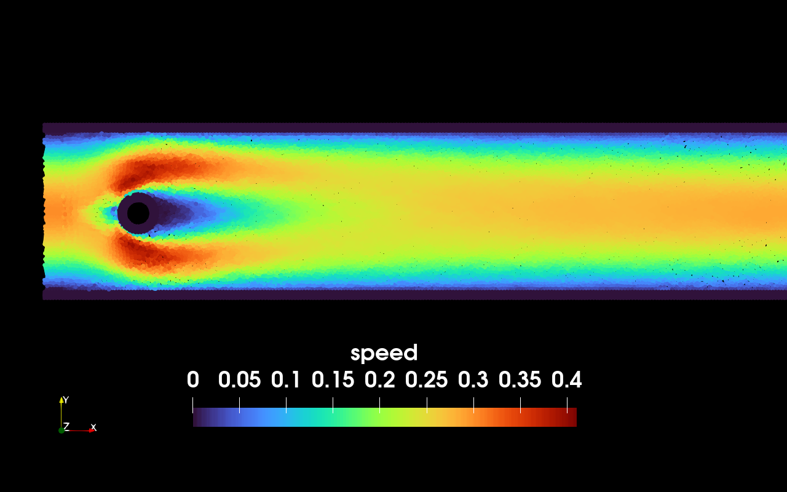

# 5: Flow around cylinder

```@raw html
	<br>
```

```@raw html
A simulation of flow around cylinder.
All parameters of this benchmark can be found <a href="http://www.mathematik.tu-dortmund.de/~featflow/en/benchmarks/cfdbenchmarking/flow/dfg_benchmark1_re20.html">here</a>
```

````julia
module cylinder

using Printf
include("../src/SPHLib.jl")
using .SPHLib
using Plots

const folder_name = "cylinder"
````

Declare constants

````julia
#geometry parameters
const dr = 4.5e-3 		#average particle distance (decrease to make finer simulation)
const h = 2.2*dr		#size of kernel support
const chan_l = 2.2      #length of the channel
const chan_w = 0.41     #width of the channel
const _cyl_x = 0.2      #x coordinate of the cylinder
const _cyl_y = 0.2      #y coordinate of the cylinder
const cyl_r = 0.05      #radius of the cylinder
const wall_w = h        #width of the wall
const inflow_l = 3.0*dr #width of inflow layer
const outflow_l = 3.0*dr #width of outflow layer
const symmetry_type = "square"

#physical parameters
const U_max = 0.3       #maximum inflow velocity
const rho0 = 1.0		#referential fluid density
const m = rho0*dr^2		#particle mass
const c = 10.0*U_max	#numerical speed of sound
const mu = 1.0e-3		#dynamic viscosity of water
const nu = 1.0e-3		#pressure stabilization

#temporal parameters
const dt = 0.2*h/c      #time step
const dt_frame = 0.08   #how often data is saved
const t_end = 4.0       #end of simulation

#particle types
const FLUID = 0.
const WALL = 1.
const INFLOW = 2.
const OBSTACLE = 3.
````

Declare fields (unknowns)

* `Dx`, `Dy` = velocity
* `Fx`, `Fy` = force
* `rho` = density
* `P` = pressure
* `Drho` = rate of density
* `type` = particle type

````julia
#define particle
@define_particle Particle Dx Dy Fx Fy rho Drho P type

@fastmath function inflow_velocity(y::Float64)::Float64
    return 4.0*U_max*y*(chan_w - y)/chan_w^2
end

function main()
    xrange = (-inflow_l, chan_l)
    yrange = (-wall_w, chan_w + wall_w) #to include walls in the simulation
    sys = ParticleSystem(Particle, xrange, yrange, dr, h)

    #define geometry
    pipe = Rectangle((-inflow_l, chan_l), (0., chan_w))
    (cyl_x, cyl_y) = SPHLib.snap_to_grid(sys, _cyl_x, _cyl_y; symmetry = symmetry_type)
    circ = Circle(cyl_x, cyl_y, cyl_r)
    pipe = BooleanDifference(pipe, circ)
    wall = BoundaryLayer(pipe, dr, wall_w; symmetry = symmetry_type)
    wall = Specification(wall, (x,y) -> (-inflow_l <= x <= chan_l))
    inflow_layer = Specification(pipe, (x,y) -> (x < 0.))
    pipe = Specification(pipe, (x,y) -> (x >= 0.))

    #generate particles
    generate_particles!(sys, pipe, (x,y) -> Particle(x, y; rho = rho0, type = FLUID); symmetry = symmetry_type)
    generate_particles!(sys, inflow_layer, (x,y) -> Particle(x, y; rho = rho0, type = INFLOW, Dx = inflow_velocity(y)); symmetry = symmetry_type)
    generate_particles!(sys, wall, (x,y) -> Particle(x, y; rho = rho0, type = is_inside(x,y,circ) ? OBSTACLE : WALL); symmetry = symmetry_type)

    #this initial condition prevents shock waves
    for p in sys.particles
        if p.x > chan_w && p.type == FLUID
            p.Dx =  inflow_velocity(p.y)
        end
    end

    #Define interactions between particles

	@fastmath function balance_of_mass!(p::Particle, q::Particle, r::Float64)
        p.Drho += ( (p.x - q.x)*(p.Dx - q.Dx) + (p.y - q.y)*(p.Dy - q.Dy) #divergence of velocity
					+ 2.0*nu*(p.rho - q.rho) #pressure stabilization
				  )*m*rDwendland2(h,r)
	end

    @fastmath function find_pressure!(p::Particle)
        p.rho += p.Drho*dt
        p.Drho = 0.0
        p.P = rho0*c^2*((p.rho/rho0)^7 - 1.0)/7
    end

	@fastmath function pressure_force!(p::Particle, q::Particle, r::Float64)
		temp = -(p.P/p.rho^2 + q.P/q.rho^2)*m*m*rDwendland2(h,r)
		p.Fx += temp*(p.x - q.x)
		p.Fy += temp*(p.y - q.y)
	end

    @fastmath function viscous_force!(p::Particle, q::Particle, r::Float64)
        temp = 2.0*mu/(p.rho*q.rho)*m*m*rDwendland2(h,r)
        p.Fx += temp*(p.Dx - q.Dx)
		p.Fy += temp*(p.Dy - q.Dy)
	end

	@fastmath function move!(p::Particle)
		p.Fx = 0.0
		p.Fy = 0.0
        if p.type != WALL
            p.x += p.Dx*dt
            p.y += p.Dy*dt
        end
	end

    @fastmath function accelerate!(p::Particle)
        if p.type == FLUID
            p.Dx += 0.5*p.Fx*dt/m
            p.Dy += 0.5*p.Fy*dt/m
        end
    end

    function add_new_particles!(sys::ParticleSystem)
        new_particles = Particle[]
        for p in sys.particles
            if p.type == INFLOW && p.x - inflow_l >= 0
                p.type = FLUID
                push!(new_particles, Particle(p.x - inflow_l, p.y; rho = rho0, type = INFLOW, Dx = inflow_velocity(p.y)))
            end
        end
        append!(sys.particles, new_particles)
    end

    function calculate_force(sys::ParticleSystem)::Tuple{Float64, Float64, Float64}
        Fx = 0.
        Fy = 0.
        for p in sys.particles
            if p.type == OBSTACLE
                Fx += p.Fx
                Fy += p.Fy
            end
        end
        C_D = 2.0*Fx/((2.0*U_max/3.0)^2*(2.0*cyl_r))
        C_L = 2.0*Fy/((2.0*U_max/3.0)^2*(2.0*cyl_r))
        P_front = SPHLib.sum(sys, (p, r) -> (m/p.rho)*p.P*wendland2(h,r), cyl_x - cyl_r, cyl_y)
        P_rear  = SPHLib.sum(sys, (p, r) -> (m/p.rho)*p.P*wendland2(h,r), cyl_x + cyl_r, cyl_y)
        return (C_D, C_L, P_front - P_rear)
    end

    #Time iteration
	type = ScalarField(sys, :type, "type")
    P = ScalarField(sys, :P, "pressure")
	v = VectorField(sys, (:Dx, :Dy), "velocity")

	out_pvd = new_pvd_file(folder_name)
    out_txt = open(folder_name*"/data.txt", "w")

    #a modified Verlet scheme
	for k = 0 : Int64(round(t_end/dt))
        #move particles
        apply!(sys, move!)
        add_new_particles!(sys)
        create_cell_list!(sys)
        #compute forces
        apply!(sys, viscous_force!)
		apply!(sys, balance_of_mass!)
        apply!(sys, find_pressure!)
		apply!(sys, pressure_force!)
        #accelerate
        apply!(sys, accelerate!)
        #save data at selected frames
        if (k %  Int64(round(dt_frame/dt)) == 0)
            @printf("t = %.6e\n", k*dt)
            save_frame!(sys, out_pvd, v, P, type)
            (C_D, C_L, P_diff) = calculate_force(sys)
            @printf("C_D = %.6e\t C_L = %.6e\t P_diff = %.6e\n\n", C_D, C_L, P_diff)
            write(out_txt, string(C_D)*" "*string(C_L)*" "*string(P_diff)*"\n")
        end
        #accelerate
		apply!(sys, accelerate!)
	end
	save_pvd_file(out_pvd)
    close(out_txt)
end

function plot_results(N::Int64)
    file = readlines(folder_name*"/data.txt")[end-N-1:end-1]
    N = length(file)
    C_D    = zeros(N)
    C_L    = zeros(N)
    P_diff = zeros(N)
    for row in 1:N
        line = split(file[row])
        C_D[row] = parse(Float64, line[1])
        C_L[row] = parse(Float64, line[2])
        P_diff[row] = parse(Float64, line[3])
    end
    C_D_avg = sum(x -> x/N, C_D)
    C_L_avg = sum(x -> x/N, C_L)
    P_diff_avg = sum(x -> x/N, P_diff)
    println("C_D = ", C_D_avg)
    println("C_L = ", C_L_avg)
    println("P_diff = ", P_diff_avg)
    plot1 = plot(1:N, [C_D  (ones(N).*C_D_avg) (ones(N).*5.57953523384)], linewidth = 1.5, label = ["SPH result" "SPH average" "reference value"], xlabel = "time", ylabel = "drag coefficient", ylims = (0.7*5.57953523384, 1.3*5.57953523384))
    savefig(plot1, folder_name*"/C_D.pdf")
    plot2 = plot(1:N, [C_L  (ones(N).*C_L_avg) (ones(N).*0.010618948146)],  linewidth = 1.5, label = ["SPH result" "SPH average" "reference value"], xlabel = "time", ylabel = "lift coefficient", ylims = (-0.2, 0.5))
    savefig(plot2, folder_name*"/C_L.pdf")
    plot3 = plot(1:N, [P_diff (ones(N).*P_diff_avg)  (ones(N).*0.11752016697)], linewidth = 1.5, label = ["SPH result" "SPH average" "reference value"], xlabel = "time", ylabel = "pressure difference", ylims = (0.7*0.11752016697, 1.3*0.11752016697))
    savefig(plot3, folder_name*"/P_diff.pdf")
end

end
````

---

*This page was generated using [Literate.jl](https://github.com/fredrikekre/Literate.jl).*

